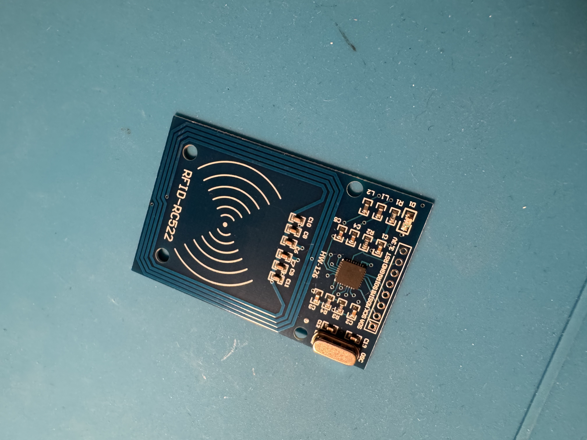
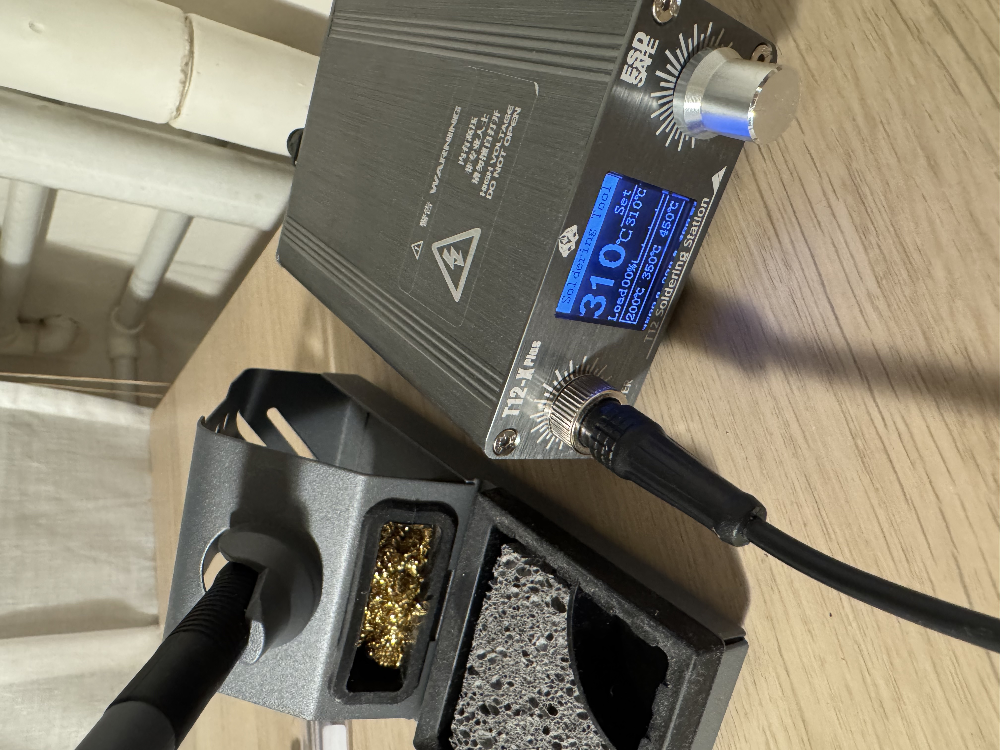
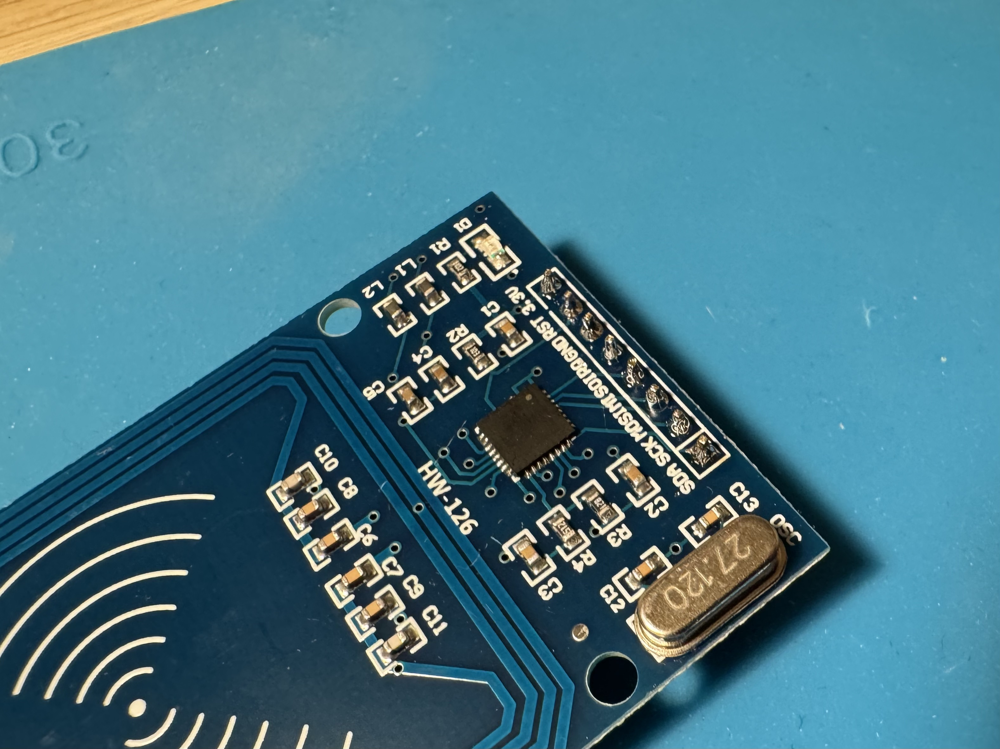
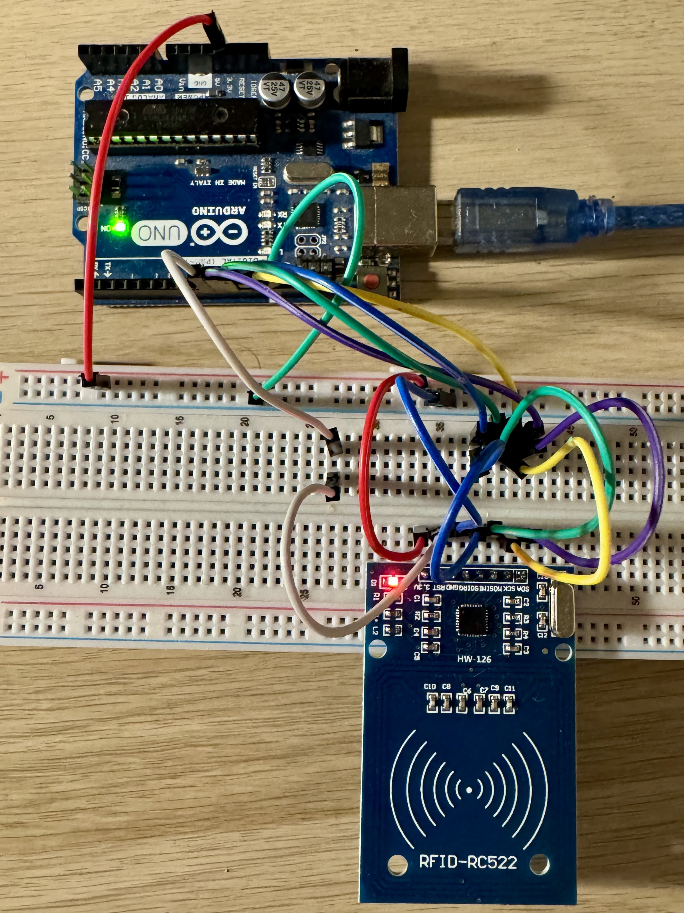

# RFID Project - sk08
## General task discription:

The goal of this task is to read a bite message from RFID card using RC522 module.

## Progress:
- [x] I bought 2 RFID modules MFRC-522 13,56 MHz
- [x] Assemble and solder RC522
- [x] Write simple sketch Blink
- [x] Connect the RC522 module to the microcontroller
- [x] Run a communication test sketch
- [x] Write code to detect a card and read its UID
- [x] Write code to read a single data block
- [x] Refactor authentication logic to be modular (by sector)
- [x] Implement function to read and print all 64 blocks (full card dump)
- [x] Refactor card dump logic into a dedicated `dump_card()` function

## Hardware Assembly
Here's a visual walkthrough of the RC522 module assembly process.

### Before Soldering
This is how the RC522 module looks before attaching the pin headers.

### Soldering Setup
Using a soldering iron set to 310°C for optimal results.

### After Soldering
The RC522 module with all pin headers soldered, ready for connection to the microcontroller.

### Temporary wiring

## TODO:
- [ ] Implement function to write data to a block
- [ ] Store a specific message on the card and read it back